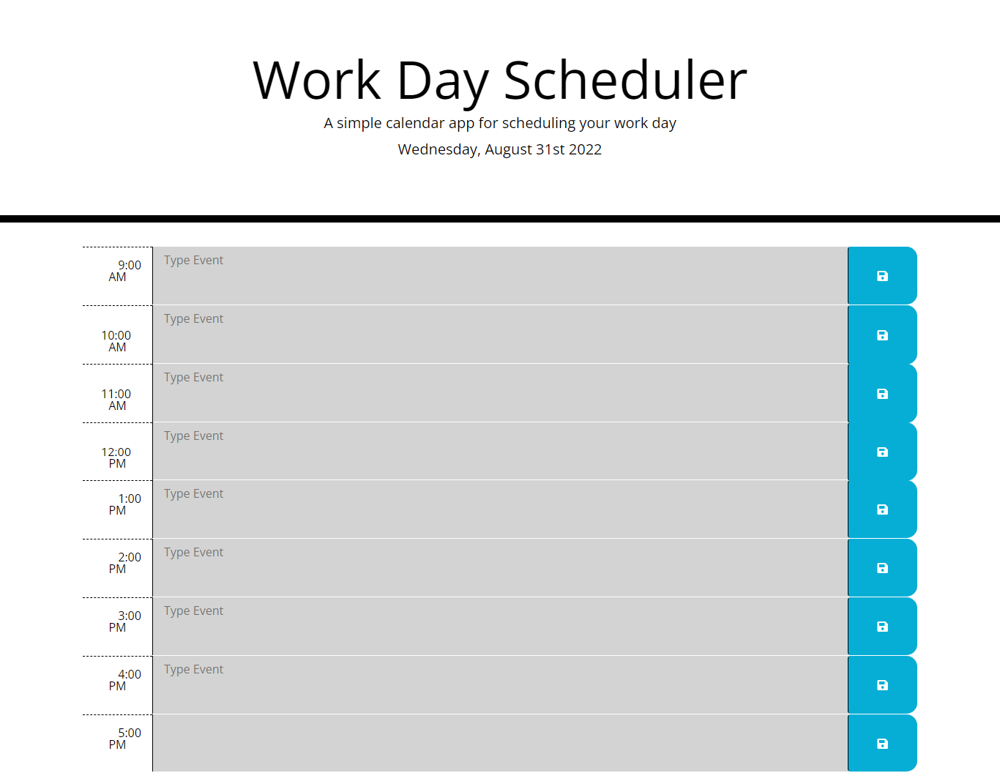

# Work Day Scheduler Starter Code

## Description

Provide a short description explaining the what, why, and how of your project. Use the following questions as a guide:

- What was your motivation? 
My motivation for this project was to understand JQuery and Moments.js

- Why did you build this project? 
I builded this project becuase I wanted to know how the API interacts with the HTML file. It's intresting what does API can do a web page. It created a complicated concept. 

- What problem does it solve?
The program solves multiple problems. The first problem that it solves is that it displays the current day of the year. The following problem that it solves it creates a similar mock of the project by using bootstrap. Depending on the time, the columbs change color. The final problem that it solves, it saves a event in local storage.   

- What did you learn?
I learned concepts of JQuery. In addition to Moments.js which it's a really intresting libary of time. The most facinating thing was bootstap, it would defiantly help me save time in the future. 

## Table of Contents (Optional)

- [Accepted Criteria](#criteria)
- [Usage](#usage)
- [Credits](#credits)
- [License](#license)

## Accepted Criteria

GIVEN I am using a daily planner to create a schedule

WHEN I open the planner

THEN the current day is displayed at the top of the calendar

WHEN I scroll down

THEN I am presented with time blocks for standard business hours

WHEN I view the time blocks for that day

THEN each time block is color-coded to indicate whether it is in the past, present, or future

WHEN I click into a time block

THEN I can enter an event

WHEN I click the save button for that time block

THEN the text for that event is saved in local storage

WHEN I refresh the page

THEN the saved events persist

## Usage

  [Website link](https://huertz.github.io/calendario/)

  `assets/images`
   md 

## Credits

If you used any third-party assets that require attribution, list the creators with links to their primary web presence in this section.

[JQuery](https://jquery.com/)

[Moments.js](https://momentjs.com/docs/#/get-set/hour/)

[Bootstap](https://getbootstrap.com/)

[parseInt](https://developer.mozilla.org/en-US/docs/Web/JavaScript/Reference/Global_Objects/parseInt)

[attr](https://www.w3schools.com/jquery/html_attr.asp)

## License

MIT License

Copyright (c) 2022 Huertz

Permission is hereby granted, free of charge, to any person obtaining a copy
of this software and associated documentation files (the "Software"), to deal
in the Software without restriction, including without limitation the rights
to use, copy, modify, merge, publish, distribute, sublicense, and/or sell
copies of the Software, and to permit persons to whom the Software is
furnished to do so, subject to the following conditions:

The above copyright notice and this permission notice shall be included in all
copies or substantial portions of the Software.

THE SOFTWARE IS PROVIDED "AS IS", WITHOUT WARRANTY OF ANY KIND, EXPRESS OR
IMPLIED, INCLUDING BUT NOT LIMITED TO THE WARRANTIES OF MERCHANTABILITY,
FITNESS FOR A PARTICULAR PURPOSE AND NONINFRINGEMENT. IN NO EVENT SHALL THE
AUTHORS OR COPYRIGHT HOLDERS BE LIABLE FOR ANY CLAIM, DAMAGES OR OTHER
LIABILITY, WHETHER IN AN ACTION OF CONTRACT, TORT OR OTHERWISE, ARISING FROM,
OUT OF OR IN CONNECTION WITH THE SOFTWARE OR THE USE OR OTHER DEALINGS IN THE
SOFTWARE.

---

🏆 The previous sections are the bare minimum, and your project will ultimately determine the content of this document. You might also want to consider adding the following sections.

## Badges

Badges aren't necessary, per se, but they demonstrate street cred. Badges let other developers know that you know what you're doing. Check out the badges hosted by [shields.io](https://shields.io/). You may not understand what they all represent now, but you will in time.

## Features

If your project has a lot of features, list them here.

## How to Contribute

If you created an application or package and would like other developers to contribute it, you can include guidelines for how to do so. The [Contributor Covenant](https://www.contributor-covenant.org/) is an industry standard, but you can always write your own if you'd prefer.

## Tests